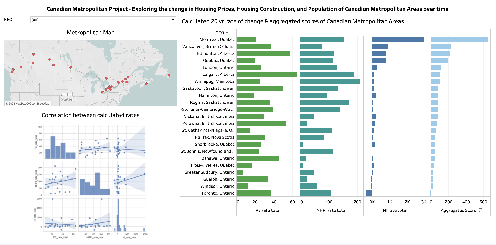
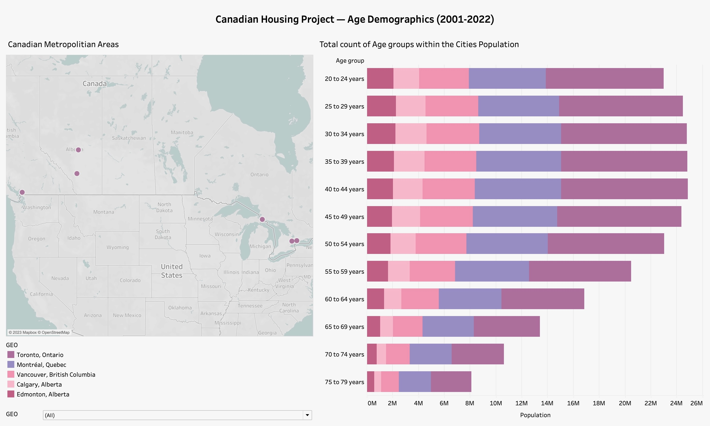
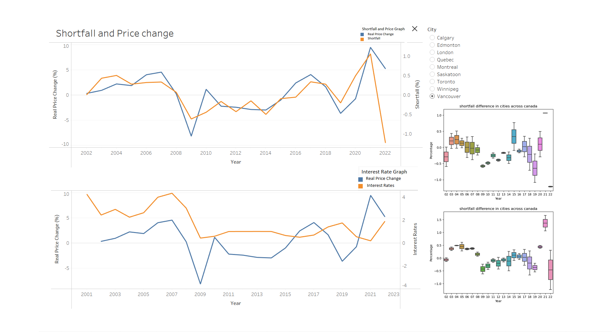

# Group 01 - Canadian Housing Project

Housing Price in the Context of Various Societal and Economic Trends

## Milestones

Details for Milestone are available on Canvas (left sidebar, Course Project).

## Describe your topic/interest in about 150-200 words

Our group is comprised of students from various backgrounds in STEM with varied levels of coding experience, however we all have an interest in investigating the cause for the increased housing costs as it is a topic we all have experience in. We suspect that the increase in housing cost is a multivariate outcome resultant from rising population numbers and a stopgap on the number of new available homes, and we plan on conducting data analysis accordingly with public datasets from Stat Canada that encompass data on these variables. We aim to illucidate the causal relationship between these identified variables and see how they vary between metropolitan areas in Canada, with the intention of providing clear information on the housing affordability of different Canadian hubs. We expect to be on track to finish this project by the beginning of April and will check in with our advisors periodically and have regularly scheduled group meetings to assess our project's timeline. 

## Describe your dataset in about 150-200 words

Our dataset comprises 4 CSV files, all obtained from the statistics canada site, and used under their open data license. The easiest to describe is the one for interest rates. The only non-metadata in the dataset is of the daily overnight interest rate as set by the Bank of Canada, which is then archived digitally and published. The index of new housing prices is similarly compact, it comprises the monthly index of housing prices broken down by land and structure value in various regions. We speculate that this data is likely gatheres through the Canada mortgage corporation and analyzed internally before publication. New inventory and population estimates are the most complex, new inventory breaks down into several categories, such as new starts and completions. For our purpose we will only look at new completions, since this gives us the best estimate of actual inventory. Population estimates is the most volumous set, this set has not only yearly population estimates, but also breakdowns by demographic. We hope to use this to analyze factors such as demographics, and how changes in demographics might affect prices. 

## Team Members

- James: I Majored in Biology but also really like economics!
- Logan: I'm an international student from California that majored in Biochemistry and Molecular Biology and minored in Psychology, Im keen to pursue a Canadian Masters in Biomedical Technology and Business Administration following undergraduate studies!
- Katrina: I'm a Microbiology undergraduate and executive on the MCU!

## Images

 

## References

[Population Estimate Dataset](https://www150.statcan.gc.ca/t1/tbl1/en/tv.action?pid=1710013501)

[New Housing Price Index Dataset](https://www150.statcan.gc.ca/t1/tbl1/en/tv.action?pid=1810020501)

[New Inventory Dataset](https://www150.statcan.gc.ca/t1/tbl1/en/tv.action?pid=3410015401)

[Canadian Interest Rate Dataset](https://www150.statcan.gc.ca/t1/tbl1/en/tv.action?pid=1010013901)

[Canadian Metropolitan Areas' Latitude/Longitude coordinates Dataset](https://community.tableau.com/s/question/0D54T00000C5vRvSAJ/census-metropolitan-areas-in-canada)