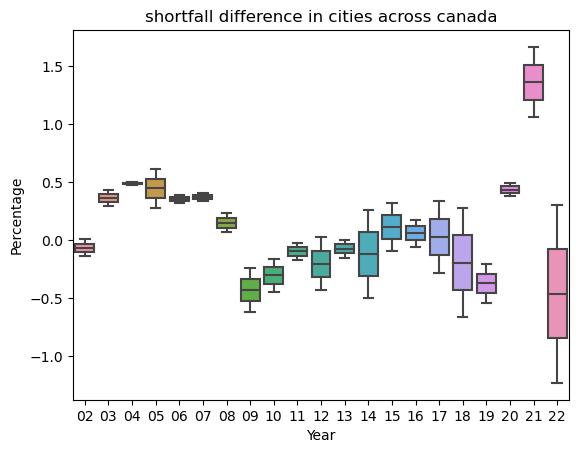
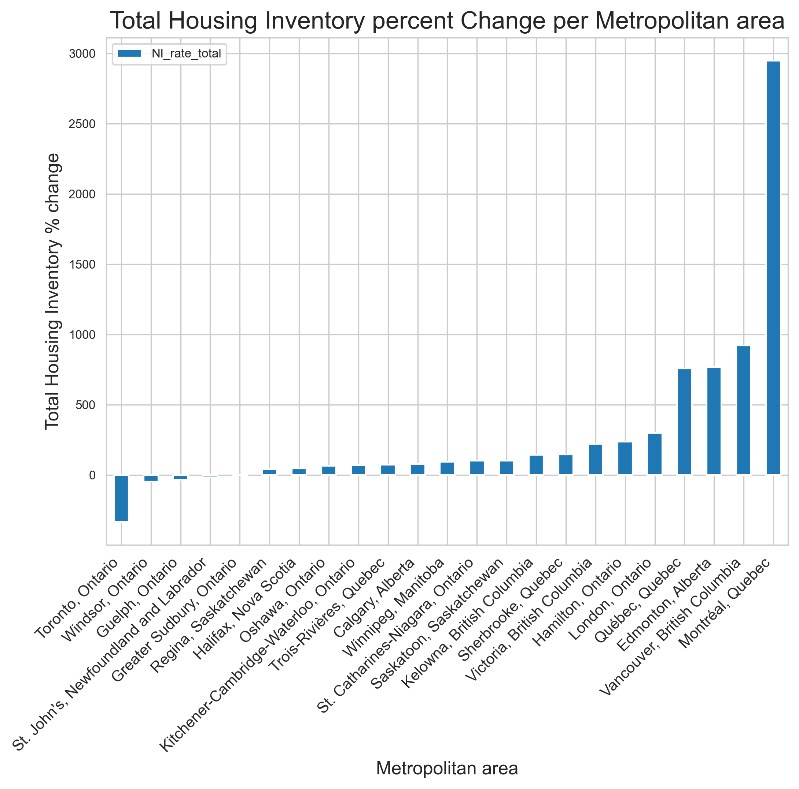

# Canadian Housing Project

## Introduction
We are looking at the housing and demographic patterns in Canadian cities. We were interested in looking at the data for this topic because housing affordability and city living is an important part of the narrative of our generation. We wanted to look at the data and see what the trends are behind the prices and also, how different city look and are composed.

## Exploratory Data Analysis
________
* EDA Conducted in Analysis 1:
    * My EDA focused on cities and the pricing of their new housing, as well as the shortfall in population.

    I extracted the data for the time period we were interest in (2001 to present) then tallied them for each year (since the population data was only yearly) then I calculated the changes between years and plotted these as data points. 
    In the end I had interest rate, new housing, population change, and new price index. All of these were then outputted for the dashboard. 
________
* EDA for conducted in Analysis 2: 
    * My EDA focused on determining what rows and columns would be necessary to include in future cleaned versions of the datasets, and determining the canadian metropolitan areas (CMA's) that should be focused on for our analyses. I did so by first visualizing the datasets and dropping irrelevant columns, then I grouped all the years of data by their geographical region, and created a bar chart of the top 30 CMA's based on population increase.
    
    
    I then carried these top 30 CMA's forward for the rest of the analysis. 
    * NOTE: EDA for analysis 2 can be found here: [Raw analysis 2](https://github.com/ubco-W2022T2-data301/project-group-group01/blob/8942e9aec2881804cb16acf74ef3e13c48e2ea8e/analysis/ungraded/Logananalysis2_raw.ipynb)
 
________
* EDA for conducted in Analysis 3:
    * My EDA focused on which cities I should chose to further my analysis, and how I will chose them. I decided to make a facet plot to visualize the cities with the highest count of the different age groups that was not based on the cities population.
     

    I used these top 5 CMA's to use for the rest of my analysis. 
    * NOTES: EDA for analysis 3 can be found here: [Raw analysis 3](https://github.com/ubco-W2022T2-data301/project-group-group01/blob/8942e9aec2881804cb16acf74ef3e13c48e2ea8e/analysis/Katrinaanalysis3.ipynb)
    

________
## Question 1 + Results 
* My research question is looking at the correlation between housing prices and shortfall. Housing affordability is a pivotal issue for my generation, and I believe that the oft touted narrative of phantom overseas buyers is only a narrative meant to distract from the fact that the true cause of housing prices is a lack of new housing as compared to population.

### How different are major Canadian cities from each other for construction:

* Here we see that between the major cities, there is a significant difference in the shortfalls they experienced. This might be due to two factors. Firstly, all cities used the same occupancy rate, while local constructions might have differed (single family homes vs condos) in the occupancy they targeted. The other factor is that this analysis looks only at percentages, and cities of different sizes have wildly different absolute shortages, which might have different outcomes on price. These limit the confidence of the conclusions, but I think there are still some conclusions that can be drawn. 

### How different are major Canadian cities from each other for Prices:

* We see in this plot that prices are much more closely distributed in major Canadian cities. This suggests that there is less connection between how much shortfall is correlated with price increases.

### Question 1 Result:

* While the general Canadian trend seems to not support the idea that there is a correlation between shortfall and prices, analysis of individual cities like vancovuer seems to paint a different picture. 
* In Vancouver, we can see that shortfalls are usually followed the next year by price jumps. This pattern provides some support for my hypothesis that shortfalls are more likely responsible for price changes as opposed to the idea that speculation drives up housing price. Though I didn't get to do the statistical analysis to scientifically prove my point, I think my graphs have somewhat helped illustrate my idea.

* This is a brief overview of my analysis, for the more complete look, see the full analysis here: [Analysis 1](https://github.com/ubco-W2022T2-data301/project-group-group01/blob/8942e9aec2881804cb16acf74ef3e13c48e2ea8e/analysis/Jamesanalysis1.ipynb)

________
## Question 2 + Results
* See the full analysis here: [Analysis 2](https://github.com/ubco-W2022T2-data301/project-group-group01/blob/8942e9aec2881804cb16acf74ef3e13c48e2ea8e/analysis/Logananalysis2.ipynb)
### Exploring the change in housing prices, new housing construction, and population of canadian metropolitan areas over time.
* For my research focus, I wanted to explore how housing in canadian metropolitan areas has changed since 2001, so visualizing the change in housing price, housing construction, and population of CMA's was the central pillar of my analysis. Every step along the way was critical to creating clean datasets that could be used to answer my question, and assist my partners in arriving at their conclusions. 
#### How has population in CMA's changed since 2001?

* As seen in the chart, in the 21 years since 2001, the top 30 metropolitan areas in Canada have continued to grow from ~5% to upwards of ~65% depending on the CMA. The fastest growing metropolitan area in Canada is Calgary, AB with Edmonton, AB and Kelowna, BC coming in close behind. 
#### How have housing prices in CMA's changed since 2001?

* As seen in this chart, housing value has increased significantly in Canada in the time period previously specified, the increases ranged from 10% to over 200%. Winnipeg has had the largest increase in housing price over 20 years, with Calgary and Regina coming in 2nd and 3rd place. Interestingly, Calgary had the largest change in population and also a large change in price. Kelowna, which was 3rd in population increase is 20th in housing price increase. I believe this may be due to Kelowna being a lake city, which would have kept the price high even 20 years ago as it is desirable.
#### How has housing construction in CMA's changed since 2001?

* New inventory, otherwise known as new residences entering the market, has varied substantially between CMA's which is due to a number of factors not investigated in my analysis. One can speculate that inventory is controlled by each city's bureaucracy, housing prices, zoning, and demand for new residences, however how these speculative variables correlate is unknown. 
* However, what can be known about housing inventory is that some areas such as Montreal, Vancouver, Edmonton, and Quebec have had substantial new inventory added to the market over the time period. Montreal had slightly under a 3000% increase whereas the other mentioned areas had between a 500% and 1000% increase in available housing in the metropolitan area. Large inventory increases are indicative of a CMA that stresses the importance of available housing, and probably is indicative of city that expects to have an upwards trend in population. Alternatively, cities with low inventory increases (or even decreases, such as Toronto and some other Ontario CMA's) most likely do not have the space to allocate for new residences, or already have a large number of residences and a high renter pool. These areas can make due with less inventory entering the market, however this will drive up housing prices and further push for a landlord's market. This claim is once again speculative, variables such as renter percentage were not obtained. 
#### Aggregate Scoring - Which CMA's are best in terms of housing?

* From the graph it can be seen that Montreal has the highest score of all other metropolitan areas by a significant margin. This is mainly due to its remarkable housing inventory and price percent change. Coming in second is Vancouver, then Edmonton. Wrapping up the top 5 metropolitan areas are Quebec and London. On the other end of things, Toronto has a negative score, due to its decrease in housing inventory percent change, meaning that there are not enough houses reaching the market to keep up with demand. The same can be said for the bottom 5 included in our analysis. Interestingly, the bottom 3 areas are all located in Ontario, which could be resultant in provincial legislation regarding housing construction or possibly just do to geographical limitations restricting increased inventory. Regardless, the worst scored areas are Toronto, Windsor, Guelph, and Greater Sudbury; whereas, the best scored areas are Montreal, Vancouver, Edmonton, and Quebec. 

________
## Question 3 + Results
* See the full analysis here: [Analysis 3](https://github.com/ubco-W2022T2-data301/project-group-group01/blob/8942e9aec2881804cb16acf74ef3e13c48e2ea8e/analysis/Katrinaanalysis3.ipynb)

### My research question looks further into the demographic of Canadian metropolitan areas
* Specifically, I looked into the age ranges of 20-39, 40-59 and then 60-79 within the top 5 Canadian metropolitan areas with the highest age count to elucidate the demographic trends of the largest CMA's.

#### Which CMA's have the highest count of age groups within their population? 

* This cat plot indicates the top 5 Canadian metropolitan areas that have the highest count of age groups within the cities population. It shows that the overview of each city and the age groups that are distributed throughout the city. In ascending order (with the city that has the highest population) it goes, Toronto, Montreal, Vancouver, Calgary and then Edmonton. 

#### What are the demographic trends occurring within the chosen top 5 CMA's? 

* Based on this graph made for Toronto, they have a high count of ages 40-44 but then it tapers off gradually as the ages increase. The ages 40-44 show to be the age group that has the highest count in Toronto. The ages groups of 50-79 have a steep decline in count. In comparison to all the top 5 cities chosen, Toronto has the highest count of population.
* Based on this graph made for Montreal, they have a lower total population count in comparison to Toronto (as seen from my Y axis, population), and their age groups within the city show a much different age demographic trend. However, the age group 40-44 is similar to Toronto, where this age group has the highest count. The ages 20-39 have a gradual increase in total count as they reach 40 years old. The ages groups of 50-79 have a steep decline in count as the ages increase.
* In Vancouver, the age group 25-29 have the highest count in the population, this is quite different from Toronto and Montreal as there is a 20 year age difference. The ages 40-49 are also at the highest count (this age groups whisker is level to the whisker for the 25-29 age group), but their upper and lower quartiles are much smaller than the 25-29 age group. From there as the ages increase, the counts decreases
significantly.
* In this graph made for Calgary, the highest count in the population is the age group 25-34. The age group 25-29's whisker is level to the the age group for 30-34 but the quartiles (for 25-29) are much smaller. As the ages increase, the count gradually decreases, where 75-79 have the lowest count in the total population.
* When I look at the Calgary versus Edmonton graphs they are quite similar! My assumption for this may be due to the fact that both of these cities are in the same province. The only difference I see, would be that the total count for individual age groups in the population is slightly smaller (as their total population is smaller), and the age group 25-29 have the highest count in the population. Both of these cities show the same trend in demographics.

### Comparative trends for chosen top 5 CMA's

* This comparative graph overlays all cities chosen and shows their demographic trends. Toronto has the highest population in respect to the other cities; Edmonton has the lowest population, but when shown the highest count of age groups within the cities (excluding population) Vancouver has the highest total count of age groups within the city and Calgary has the lowest total count of age groups. These results are quite shocking, as I would of assumed that Toronto has the highest count of age groups because of its high population.
* I believe the most likely answer to this trend would be that Vancouver is known to be a multicultural city, therefore immigrating residents have a variance of ages. As this is speculative, further analysis needs to be conducted using immigration status to provide evidence for this assumption.

________
## Summary/Conclusion
### Key points
* Population in canadian metropolitan areas has increased across the map, although the rate of increase varies drastically. 
* Since 2001, all regions assessed have increase in housing prices, with the largest increase being in Winnipeg (over 200% increase)
* Most CMA's have had an increase in housing inventory, but some regions (Toronto and other Ontario CMA's) have had a decrease or stable inventory. Having more inventory added is beneficial, therefore higher ranked CMA's must have a significant increase in market availability. 
* Based on aggregated scoring, Montreal, Vancouver, Edmonton, and Quebec are the top CMA's; Toronto, Windsor, Guelph, and Greater Sudbury are the bottom CMA's of the 30 assessed. 
* Toronto, Montreal, Vancouver, Calgary and Edmonton have the highest counts for the age groups, 20-39, 40-59 and 60-79 within their population. 
* High population does not necessarily mean it will have a high variance in different age groups. 
### Conclusion

The initial scope of our project was to investigate different aspects of the canadian housing market and how it varies among canadian metropolitan areas. With that aim in mind, we tackled questions related to the housing market and CMAs' individually that could provide us with collective insight to our project topic. Based on the graphs from analysis 1, it can be seen that there appears to be some correlation in cities such as Vancouver between price rises and housing shortfalls; however, these patterns are not reproduced throughout all cities studied, indicating that there are variables not assessed which affect the correlation on a individual CMA basis. Resulting from analysis 2, it is clear that the largest canadian metropolitan areas have all had significant increases in both population and housing prices, and have had varied increases (and some decreases) related to housing market inventory. The top rated regions with respect to the rate at which population, housing price, and housing market inventory increased are Montreal, Vancouver, Edmonton, and Quebec. A number of CMA's fall short on one of the three calculated rates even though they may have been ranked quite well on the other metrics, such as Calgary or Kelowna, which had decreased their total ranking over all. Furthermore, this analysis only assessed three variables, and could be improved upon by adding more data to more accurately depict the shortcomings of each metropolitan area. The major findings from the results of analysis 3 indicated that Toronto, Montreal, Vancouver, Calgary and Edmonton each have their own unique demographic trends, thus influencing factors of housing within that specific CMA. Additionally, the demographic trends occurring in the CMA's is not reliant on how exceedingly large the population may be, some areas may have a far smaller population with a wider distribution of age ranges compared to areas with a much higher population but narrower distribution. As a whole, our project was successful in investigating different aspects related to the canadian housing market and variance between canadian metropolitan areas. 
